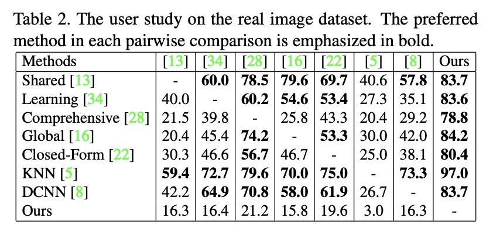

# Image Matting

# 简介

### 问题定义

$I = \alpha F + (1-\alpha) B$

其中，$I$ 是 Image，$F$ 是 Foreground，即前景，$B$ 是Background，即背景，$\alpha$ 是图片的透明度，表示每个像素处前景和背景的比例。

Image Matting问题是已知$I$，求$\alpha$、$F$ 、$B$ 。

有3个已知数，7个未知数，这个问题很难。

### Image segmentation and Image matting

* Image segmentation：图像分割就是把每一个像素都分类为一个类别。

* Image matting：就是我们常说的抠图。photoshop里抠图，有个边缘羽化的功能，如果分割完直接替换背景，可能会带来很多不自然的边缘过度，一眼就能看出来是假图。再者说，对于细到头发丝这样的像素，仅仅是二分类的图像分割是很难完美解决的。

# Deep Image Matting

## Info

* Title: Deep Image Matting
* Paper link: https://arxiv.org/pdf/1703.03872.pdf
* Conference: CVPR2017

## TL; DR (summarize this paper in one sentence or two)

此前，Image matting大多采用传统方法；深度学习算法只能处理一些简单的图片，如果前景和背景颜色相似，或者纹理比较复杂，表现就不好；本文提出了一种表现优秀的deep model。

## Contribution

### New matting dataset

在此论文之前，image matting的数据集极少，不足以支持训练深度神经网络

* train dataset： 493 unique foreground objects， 49,300 images

* test dataset：50 unique foreground objects， 1,000 images

* trimap: use alpha matte randomly dilate 随机膨胀

### Method

#### network

* 模型分为两个阶段
* Matting encoder-decoder stage
  * deep convolutional encoder-decoder network
  * input : an image patch and a trimap concatenated to a 4-channel input
  * alpha-prediction loss
  
  *  compositional loss
  
  * $L = w_l \cdot L_{\alpha} + (1-w_l) \cdot L_c $  Specifically, wi = 1 if pixel i is inside the unknown region of the trimap while wi = 0 otherwise. (pay more attention on the important areas)

* Matting refinement stage
  * 上一阶段出来的边缘过于平滑，此阶段进行精修。
  * 4个卷积层
  * 只有alpha-prediction loss
* 训练：先训第一阶段，再训第二阶段，最后一起fintune

## Experiment

### The alphamatting.com dataset

* 每张图片有三种trimaps
* 衡量指标为SAD(sum of Absolute Differences)

### The Composition-1k testing dataset

* Guided filter：何凯明提出的导向滤波算法，能在滤波的同时，保留边缘细节。
* 与其他算法的对比，及自身的消冗实验。

### The real image dataset

* real image没有GT，所以找了392个人，每次随机提供两个算法再同一张图上跑出来的结果。

#  Semantic Human Matting

## Info

- Title: Semantic Human Matting
- Paper link: https://arxiv.org/pdf/1809.01354.pdf
- Conference: ACM Multimedia 2018

##  TL; DR (summarize this paper in one sentence or two)

在特定的人物数据集上做Image matting，并在Deep Image Matting的基础上加了一个Trimap生成网络。

## Contribution

### HUMAN MATTING DATASET

* 链接：https://github.com/aisegmentcn/matting_human_datasets
* 前景图来源：
  * 来源1：
    * 从商业网站上找了 188,000 张图片，先找人标注
    * 对标注的数据进行筛选和二次确认，只留下了35311张图片，质量很高
    * 都是人物半身图
  * 来源2：
    * 从Deep Image Matting论文开源的数据集中挑选人像图	
    * 用202张人像前景，通过施加不同的背景，生成了20200张图片
* 背景图来源：
  * 从COCO数据集和网上找背景图，保证背景中没有人像
  * 所有背景图都是随机选取，且保证不重复

### Method

* T-Net： 不需要任何辅助信息（trimap，scribbles），对RGB图片做像素级的分类，分成foreground，background，and unknown regions.
  * 负责语义分割，有三种语义
  * 输出一个3-channel的map
  * T-net可以采用任何stoa的semantic segmentation networks
* M-Net：负责捕获详细信息，生成alpha matte
  * input：3-channel的RGB图片和3-channel的T-net output，concat成6-channel的input
  * deep convolutional encoder-decoder network
* Fusion Model：
  * 发现M-Net只关注unknown regions，把unknown regions的结构、纹理细节弄好了
  * 融合M-net的结果和T-net的结果，得到每个像素属于foreground的概率
* Loss：

与Deep image matting相比，并没有特殊关注unknown regions。

## Experiment

* 用本论文预测出来的Trimap作为其他模型的输入

* 用Ground Truth的Trimap作为其他算法的输入

* 消冗实验

* real image

