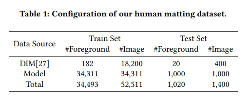
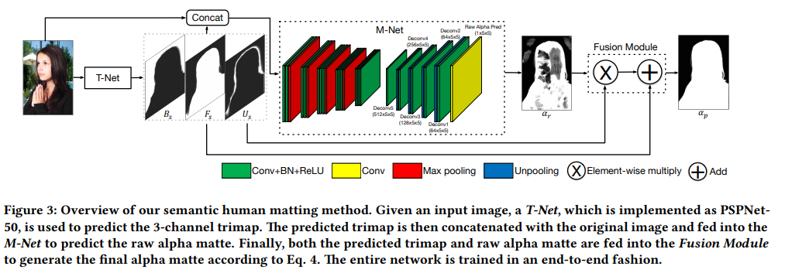

# 任务简介

给一张图片，从图片中将人像抠出来。可以用于换背景等工作。

# 数据集

## HUMAN MATTING DATASET

* 链接：https://github.com/aisegmentcn/matting_human_datasets
* 所有数据的前景图（人物）和背景图来源不同
* 前景图来源：
  * 来源1：
    * 从商业网站上找了 188,000 张图片，先找人标注
    * 对标注的数据进行筛选和二次确认，只留下了35311张图片，质量很高
    * 都是人物半身图
  * 来源2：
    * 从Deep Image Matting论文开源的数据集中挑选人像图	
    * 用202张人像前景，通过施加不同的背景，生成了20200张图片
* 背景图来源：
  * 从COCO数据集和网上找背景图，保证背景中没有人像
  * 所有背景图都是随机选取，且保证不重复

# 相关论文

## Semantic Human Matting

### Network

* T-Net： 不需要任何辅助信息（trimap，scribbles），对RGB图片做像素级的分类，分成foreground，background，and unknown regions.
  * 负责语义分割，有三种语义
  * 输出一个3-channel的map
  * T-net可以采用任何stoa的semantic segmentation networks
* M-Net：负责捕获详细信息，生成alpha matte
  * input：3-channel的RGB图片和3-channel的T-net output，concat成6-channel的input
  * deep convolutional encoder-decoder network
* Fusion Model：
  * 发现M-Net只关注unknown regions，把unknown regions的结构、纹理细节弄好了
  * 融合M-net的结果和T-net的结果，得到每个像素属于foreground的概率

### Loss

